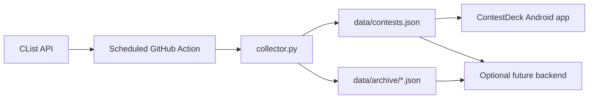

# ContestDeck Data: Project and AI-Agent Handoff

This file is the durable context for future AI agents working on the ContestDeck Android app, an optional backend, or this data pipeline. Read it before making architectural or schema changes. `README.md` remains the user-facing operational guide; this file explains the decisions and integration contract.

## Project identity and status

- Product name: **ContestDeck**. It replaces the earlier **TruCoder** name.
- Data repository: <https://github.com/MaskedCarrot/contestdeck-data>
- Local repository: `/Users/apoorv/Projects/contestdeck-data`
- Public feed: <https://raw.githubusercontent.com/MaskedCarrot/contestdeck-data/main/data/contests.json>
- Archive index: <https://raw.githubusercontent.com/MaskedCarrot/contestdeck-data/main/data/archive/index.json>
- Upstream source: [CList](https://clist.by)
- Runtime: Python 3.13 standard library only; no database, server, package installation, or paid hosting.
- Initial implementation commit: `d233f77` (`feat: create ContestDeck data feed`).
- Initial GitHub Actions CI passed.
- The first authenticated data refresh succeeded in commit `9708601`, populating the current feed and monthly archives from February through August 2026. This confirms that the GitHub secrets and CList authentication work.
- Remaining migration work: confirm a following unchanged `incremental` run creates no commit, migrate Android/backend consumers, then deprecate and archive the legacy repository.

The legacy repository, <https://github.com/MaskedCarrot/trucoder-data>, is still public and unarchived until the replacement feed is verified. Its API key was published in Git history and must be revoked. Never copy that key into this repository, documentation, an app, a backend, logs, issues, or chat.

## Why this architecture exists

The old repository used a hardcoded CList key, stale numeric resource IDs, a 300-record limit, no timeout/retry/validation, and a GitHub Action that often failed while committing. ContestDeck Data is a clean rebuild that keeps the free static-feed model while removing those failure modes.



GitHub is both the scheduler and static data host. A backend is not required merely to show contests. Add one only for server-owned features such as accounts, cross-device preferences, notifications, analytics, or data that should not live in a mobile client.

## Public contract

`data/contests.json` contains every running or future contest returned for the configured resources. It is not capped at 300 records.

```json
{
  "schemaVersion": 1,
  "updatedAt": "2026-08-23T10:00:00Z",
  "source": {
    "name": "CLIST",
    "url": "https://clist.by"
  },
  "retentionDays": 183,
  "contests": [
    {
      "id": "clist:123456",
      "platform": "codeforces",
      "name": "Codeforces Round 1000",
      "url": "https://codeforces.com/contest/1234",
      "startsAt": "2026-08-25T14:35:00Z",
      "endsAt": "2026-08-25T16:35:00Z"
    }
  ]
}
```

Contract rules:

- `schemaVersion` is currently `1`. Clients must reject or deliberately migrate unsupported future versions.
- `id` is a stable string in the form `clist:<contest-id>`. It is not a platform ID.
- `platform` is a stable lowercase slug.
- `startsAt` and `endsAt` are UTC ISO-8601 timestamps ending in `Z`.
- Records are sorted by `startsAt`, then `platform`, then `id`.
- A contest is running when `startsAt <= now < endsAt`; it is upcoming when `now < startsAt`. Clients should compute status instead of storing another status field.
- `updatedAt` changes only when normalized snapshot content changes. Identical refreshes create no commit.
- This is a clean break from TruCoder's numeric platform identifiers, millisecond timestamps, `link`, `startTime`, and `endTime` fields. Do not add legacy compatibility unless a migration explicitly requires it.

Supported slugs and exact CList hosts:

| Slug | CList resource host |
| --- | --- |
| `codeforces` | `codeforces.com` |
| `codechef` | `codechef.com` |
| `atcoder` | `atcoder.jp` |
| `leetcode` | `leetcode.com` |
| `hackerrank` | `hackerrank.com` |
| `hackerearth` | `hackerearth.com` |
| `topcoder` | `topcoder.com` |
| `meta-hacker-cup` | `facebook.com/hackercup` |
| `icpc` | `icpc.global` |
| `nowcoder` | `ac.nowcoder.com` |
| `luogu` | `luogu.com.cn` |
| `cphof` | `cphof.org` |

The collector resolves these hosts through the CList resource API on every run. Do not restore hardcoded CList numeric resource IDs.

## Archive contract

Ended contests from the previous 183 days are stored in `data/archive/YYYY-MM.json`, grouped by UTC end month:

```json
{
  "schemaVersion": 1,
  "month": "2026-08",
  "contests": []
}
```

`data/archive/index.json` lists available months:

```json
{
  "schemaVersion": 1,
  "updatedAt": "2026-08-23T10:00:00Z",
  "archives": [
    {
      "month": "2026-08",
      "path": "data/archive/2026-08.json",
      "count": 42,
      "sha256": "<digest-of-exact-file-bytes>"
    }
  ]
}
```

Consumers that need history should fetch the index first and then only the required months. The Android home/upcoming experience should normally need only `data/contests.json`.

## Collection behavior

The single implementation file is `collector.py`.

- `incremental`: fetches every current/future contest and the last seven days, while preserving older local archive entries until reconciliation. If no archive exists, it automatically uses a full reconciliation window.
- `reconcile`: rebuilds the current feed and complete rolling 183-day archive.
- `dry-run`: performs reconciliation and validation but writes nothing.

Safety and reliability behavior:

- 20-second HTTP timeout.
- Maximum four attempts for network errors, HTTP 429, and HTTP 5xx.
- Exponential retry delays with `Retry-After` support.
- At least 6.1 seconds between requests to respect CList's standard 10-requests-per-minute limit.
- Pagination continues until `meta.next` is empty, with loop and safety-limit detection.
- Authentication failures, unresolved resources, malformed JSON, invalid timestamps/URLs, conflicting IDs, empty responses, partial pages, and invalid existing data fail the run.
- All output is built and validated before tracked data is replaced. A failed fetch or validation leaves the last known-good data untouched.
- Writes are deterministic and no-op when content is unchanged.
- Monthly archive digests and retention boundaries are validated before writing.

## GitHub Actions

Two workflows live in `.github/workflows/`:

- `ci.yml`: runs the offline `unittest` suite on pushes to `main` and on pull requests.
- `refresh.yml`: runs tests, collects data, stages only `data/`, commits real changes, and pushes with one rebase retry.

Automatic schedules use UTC:

- `17 */3 * * *`: incremental refresh every three hours at minute 17.
- `47 2 * * 0`: full reconciliation every Sunday at 02:47 UTC (08:17 IST).

Schedules are deliberately away from the start of an hour because GitHub can delay scheduled workflows during high load. The refresh job has `contents: write`, a 20-minute timeout, and a single non-cancelling concurrency group.

Required GitHub Actions secrets:

- `CLIST_USERNAME`: the CList username.
- `CLIST_API_KEY`: only the current private API-key value, without an `Authorization:` prefix or query string.

Adding secrets does not immediately run the workflow. Manually run `reconcile` once from **Actions → Refresh contest data → Run workflow**, then run `incremental` to confirm an unchanged feed produces no commit.

## Android integration guidance

The Android app can consume the raw JSON endpoint directly over HTTPS.

- Model IDs as strings, not integers.
- Parse timestamps as instants/UTC and convert only for display.
- Check `schemaVersion` before decoding the contest list.
- Cache the last valid response locally and keep displaying it on transient network or parsing failures.
- Replace cached data only after the full response validates.
- Use `id` as the database/list identity and deduplication key.
- Derive running/upcoming state from the device clock and timestamps.
- Open `url` externally or in a trusted browser surface; do not treat it as executable content.
- Display attribution such as “Contest data provided by CList.”
- Never include the CList username/API key in the APK. The app needs only the public generated feed.

If the app needs old contests, read `archive/index.json` and request the required monthly file. Do not download all archives on every launch.

## Optional backend integration guidance

A future backend should treat this repository's JSON as a read-only upstream contract.

- Fetch and cache the public feed; do not scrape individual contest platforms again unless a new requirement justifies it.
- Preserve ContestDeck IDs, platform slugs, and UTC timestamps at the backend boundary.
- Validate `schemaVersion`, required fields, unique IDs, and timestamp ordering before replacing cached data.
- Keep the last valid version when GitHub or parsing fails.
- Avoid proxying the feed if the backend adds no authentication, personalization, notification, or aggregation value.
- Do not store or expose the CList key. The collector is the only component that needs CList credentials.

If a new backend-owned API changes field names or adds pagination, define it as a separate versioned contract rather than silently changing this feed.

## Development and maintenance

Run from the repository root:

```bash
python -m unittest discover -s tests -v

export CLIST_USERNAME="your-clist-username"
export CLIST_API_KEY="your-current-private-key"
python collector.py dry-run
python collector.py reconcile
```

Repository map:

- `collector.py`: API client, normalization, validation, archive generation, and CLI.
- `tests/test_collector.py`: offline tests with fake CList responses; no credentials or network required.
- `data/contests.json`: current/running feed.
- `data/archive/`: rolling history and digest index.
- `.github/workflows/`: CI and scheduled refresh automation.
- `.env.example`: secret names only; `.env` is ignored.

When adding a platform, update the exact host-to-slug map in `PLATFORMS`, add/adjust tests, run a dry-run, and treat any slug change as a client-contract change.

When changing the public schema:

1. Decide the client migration first.
2. Increment `schemaVersion` for breaking changes.
3. Update collector validation, tests, README, and this file together.
4. Deploy clients that understand the new version before removing support for the previous contract.

Do not manually edit generated data except to recover from a documented emergency. Fix the collector or upstream mapping and regenerate it.

## Security, source terms, and migration checklist

- The old CList key is compromised because it was committed publicly. Revoke it and use a new key only in GitHub encrypted secrets.
- Never print authenticated URLs or secret values in workflow output.
- CList requires credentials to remain secret, reasonable caching, rate-limit compliance, and attribution.
- Review <https://clist.by/api/v2/doc/> and <https://clist.by/terms/> before changing usage or republishing the dataset.
- The MIT license covers repository source code; upstream contest data remains subject to source terms.

Migration is complete only when:

1. The replacement key is stored as both required GitHub secrets.
2. A manual `reconcile` run succeeds and populates the feed and archives.
3. A following `incremental` run succeeds and creates no redundant commit when data is unchanged.
4. Android/backend consumers use the new endpoint and schema.
5. The old `trucoder-data` README points to ContestDeck Data and the old repository is archived.

## Quick checklist for future AI agents

1. Read this file, `README.md`, `collector.py`, both workflows, and the relevant tests.
2. Run the offline tests before changing anything.
3. Preserve the versioned JSON contract unless the user explicitly approves a migration.
4. Never request, reveal, commit, or log an API key.
5. Prefer the public generated feed for clients; do not duplicate the CList collector in Android or a backend.
6. Keep the last known-good data on every failure path.
7. Update tests and this handoff whenever architecture or contract decisions change.
